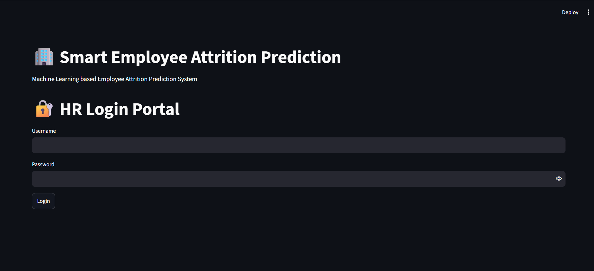
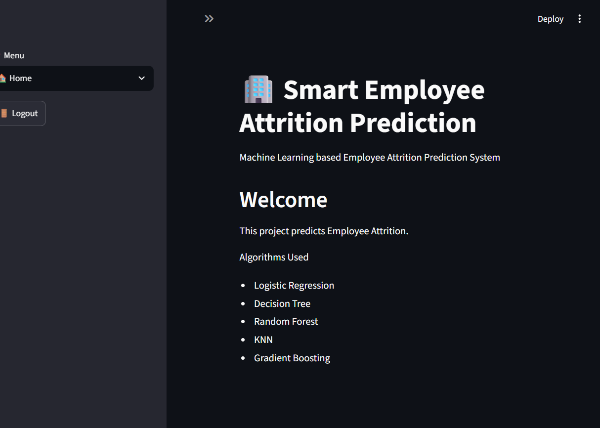
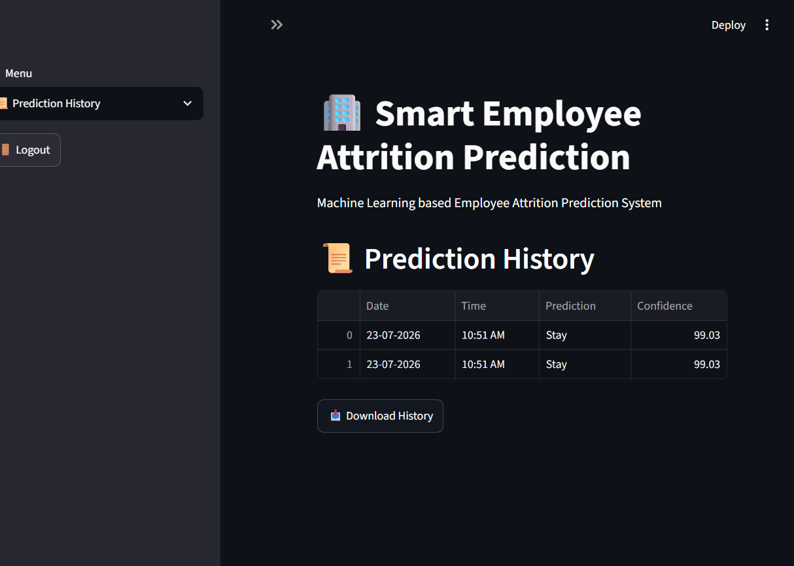
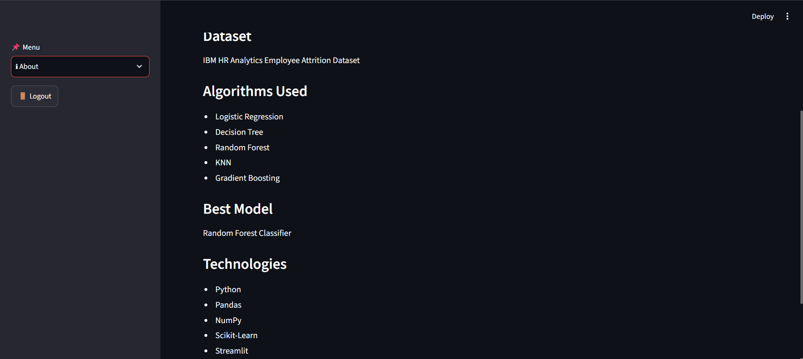

# 🏢 Smart Employee Attrition Prediction

A Machine Learning-based HR Analytics application that predicts whether an employee is likely to leave the company or stay. The project is developed using Python, Scikit-learn, and Streamlit to help HR professionals make data-driven employee retention decisions.

#  Project Highlights

- 🔐 Secure Login Authentication
- 📊 Interactive HR Dashboard
- 🤖 Real-time Employee Attrition Prediction
- 📂 Batch Prediction using CSV Upload
- 📜 Prediction History Tracking
- 📥 Download Prediction Report (CSV)
- 📈 Confidence Score for Every Prediction
- 🚪 Secure Logout Functionality

#  Problem Statement

Employee attrition is one of the major challenges faced by organizations. Losing experienced employees increases recruitment costs and impacts productivity.

This application helps HR teams identify employees who are at higher risk of leaving the organization so preventive actions can be taken in advance.

#  Machine Learning Workflow

Employee Dataset
        │
        ▼
Data Cleaning
        │
        ▼
Data Preprocessing
        │
        ▼
Label Encoding
        │
        ▼
Feature Scaling
        │
        ▼
Model Training
        │
        ▼
Model Evaluation
        │
        ▼
Model Saving (.pkl)
        │
        ▼
Streamlit Web Application
        │
        ▼
Employee Attrition Prediction

#  Machine Learning Algorithms Used

- Logistic Regression
- Decision Tree Classifier
- Random Forest Classifier
- K-Nearest Neighbors (KNN)
- Gradient Boosting Classifier

Random Forest was selected as the final model based on its performance.

#  Features

###  Login Module

- Username & Password Authentication
- Secure Login
- Logout Option

### Home Page

- Project Overview
- Algorithms Used

###  Dashboard

- Total Employees
- Total Features
- Dataset Preview
- Attrition Count
- Department Distribution
- Gender Distribution
- OverTime Distribution

###  Employee Prediction

Predict whether an employee is:

- ✅ Stay
- ❌ Leave

Displays:

- Prediction Result
- Confidence Score
- 
###  Batch Prediction

- Upload Employee CSV File
- Preview Uploaded Dataset
- Ready for Bulk Prediction

###  Prediction History

Stores

- Prediction Date
- Prediction Time
- Prediction Result
- Confidence Score

### Report Generation

Download prediction result in CSV format.

# Dataset

IBM HR Analytics Employee Attrition Dataset

Important Features include:

- Age
- Department
- Job Role
- Business Travel
- Monthly Income
- Education
- Gender
- Job Satisfaction
- Work Life Balance
- Overtime
- Performance Rating
- Years At Company
- Years In Current Role
- Years Since Last Promotion
- Years With Current Manager

# Technologies Used

### Programming

- Python

### Machine Learning

- Scikit-learn
- Joblib

### Data Analysis

- Pandas
- NumPy

### Web Framework

- Streamlit

### Version Control

- Git
- GitHub

#  Project Structure

Smart_Employee_Attrition_Prediction
│
├── app.py                         # Streamlit Web Application
├── main.py                        # Model Training
├── employee_attrition.csv         # Original Dataset
├── clean_employee_attrition.csv   # Cleaned Dataset
├── employee_attrition_model.pkl   # Trained ML Model
├── scaler.pkl                     # Standard Scaler
├── encoders.pkl                   # Label Encoders
├── prediction_history.csv         # Prediction History
├── requirements.txt
└── README.md

#  Installation

### Clone Repository
git clone https://github.com/SonawaneRani/Smart-Employee-Attrition-Prediction.git

### Move into Project Folder
cd Smart-Employee-Attrition-Prediction

### Install Required Libraries
pip install -r requirements.txt

### Run the Application
python -m streamlit run app.py

#  Project Screenshots

## 🔐 Login Page

---

## 🏠 Home Page

---

## 📊 Dashboard

.png)

.png)

---

## 🤖 Employee Prediction

)

---

## 📂 Upload CSV

---

## 📜 Prediction History

---

## ⚙️ Settings

---

## ℹ️ About

# Future Enhancements

- Admin Dashboard
- Employee Management System
- Database Integration (MySQL)
- Email Notifications
- Cloud Deployment
- Role-Based Authentication
- AI Recommendation System
- Interactive Analytics Dashboard

# Business Benefits

- Reduce employee turnover
- Improve employee retention
- Support HR decision-making
- Enable proactive workforce planning
- Reduce recruitment costs

#  Developer

## Rani Sonawane
LinkedIn Link :- www.linkedin.com/in/rani-sonawane-b51587256
